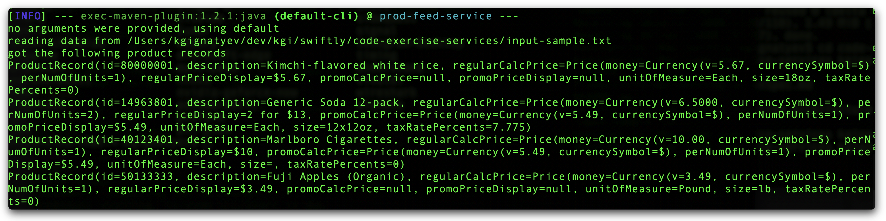
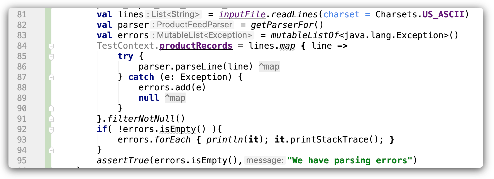
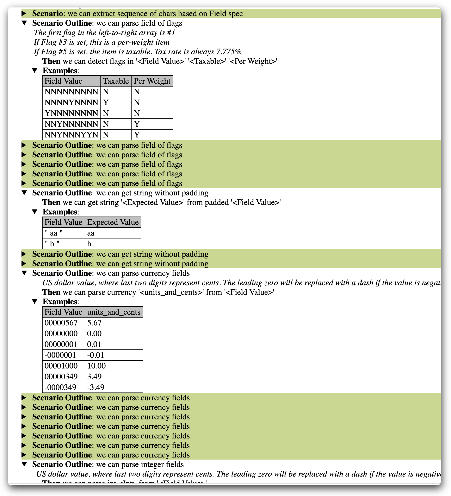

build status
---

latest [snapshot](https://ci.appveyor.com/api/buildjobs/j68rxc716mltesqd/artifacts/target%2Fprod-feed-service-1.0-SNAPSHOT.jar)

use
---

from command line:

        mvn clean package exec:java
        

from  tests        

build prerequisites
---

 1. Maven
 2. Java 8+

build
---

        mvn clean package dokka:dokka
        

documentation is generated in [target/dokka](target/dokka) folder

test and see test results
---

        mvn test
        open target/cucumber/index.html

sample output

